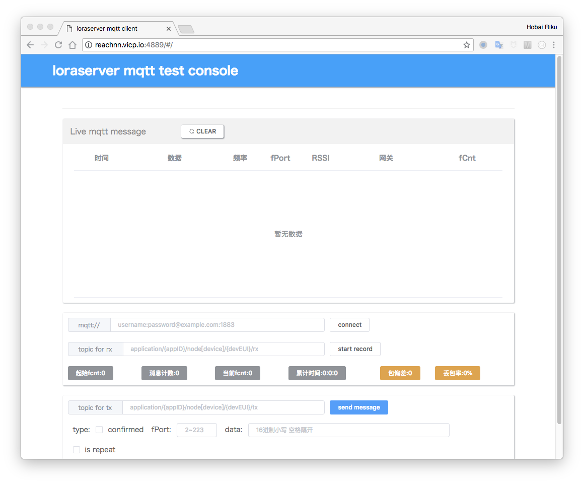

# loraserver-mqtt-test-console

this project is a simple web mqtt client tool for [loraserver](https://www.loraserver.io/) . 

Nodejs +Koa+ websocket-npm+vue+element.io

## feature:

* connect to an mqtt broker of loraserver  
* subscribe tx topic and show live mqtt message from lora app server
* fCnt and packet loss statistics 
* downLink mqtt message

## start:

you need to install nodejs 

```bash
npm run install-all
npm run build-ui
npm run start
```

Then open http://127.0.0.1:4889/

## dev:

```bash
// for server
npm run dev
// for frontend ui
npm run dev-ui
```

## screenshot:



## licence:

MIT
